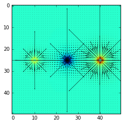

**Electromagnetic Field Visualizer V1.0**

Allows the visualization of electromagnetic fields generated  by point charges. Displays a colormap or vector map of proincharges in a 1 meter by 1 meter grid. Resolution is settable. 
Remove %matplotlib inline if not running with ipython notebook
Both .py and .ipynb provided. 

Enjoy!

**TODO**

-Add option to do colormap to show magnitude and vectors to show direction, which would be the best of both options. 

-Add an option to easily change the square area (right now set to 1m by 1m) 

**Images**

Quiver plot of one positive point charge of 1 microCoulomb centered in a 50x50 grid

Quiver plot of three point charges of 1, 2, and 3 microCoulombs, the second one negatively charged 

Quiver plot from second image with a colormap underneath.

 
Colormap of the same three point charges from the second image. 

